# Agora o trabalho de Termo vem!
Script em Python pra ajudar o pessoal da Eng. de Alimentos da Unicamp com o trabalho de Termo nem um pouco chato 🤡

# Como usar???
Caso não tenha, você precisa baixar a linguagem de programação Python, segue um breve tutorial:

## Instalando a linguagem Python
Abra a barra de pesquisa do Windows e procure pela loja da Microsoft, como na figura abaixo

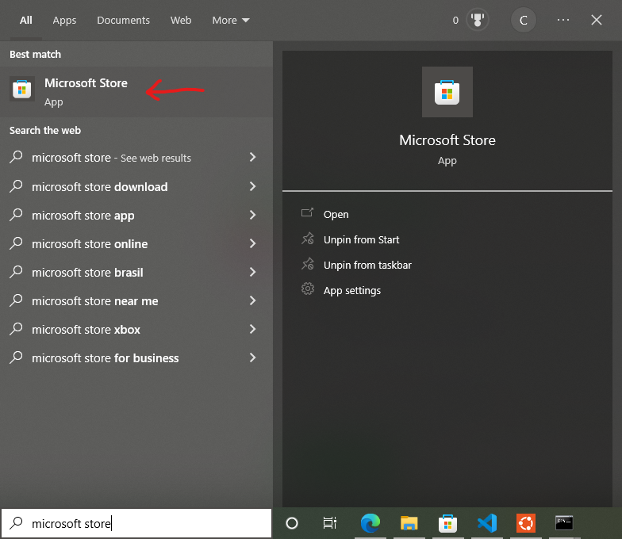

Procure por "python" na barra de pesquisa e selecione a versão indicada na figura abaixo

Agora clique em instalar

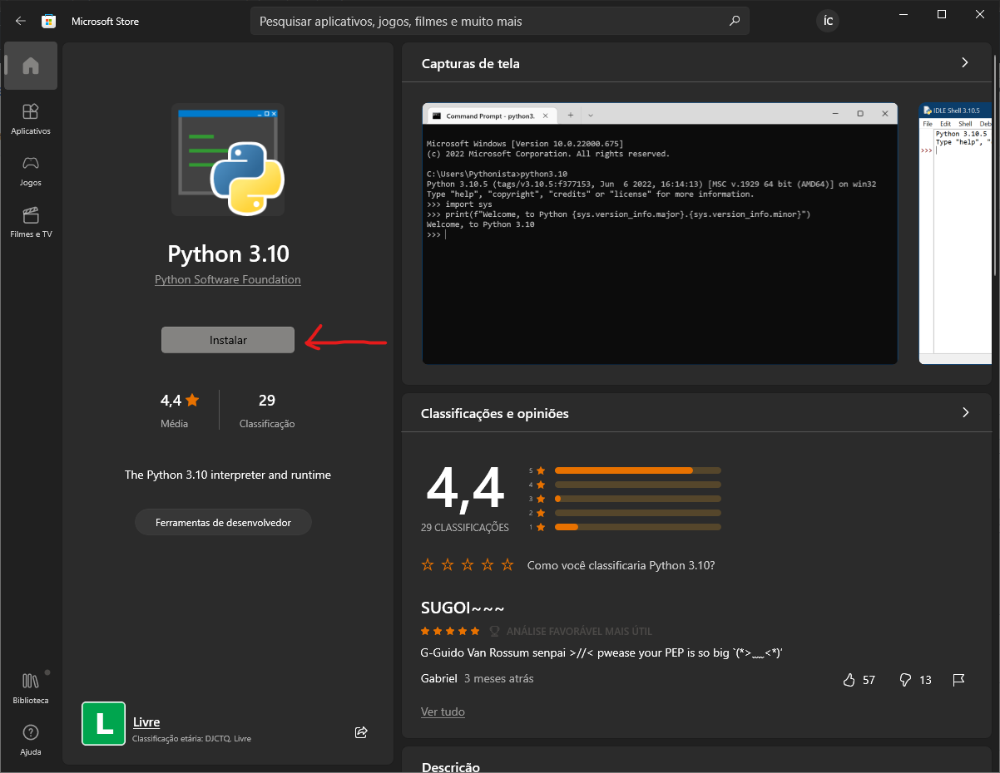

Após terminar a instalação, abra o prompt de comando procurando por "cmd" na barra de pesquisa do Windows, clique com o botão direito e execute como administrador, como exemplificado abaixo

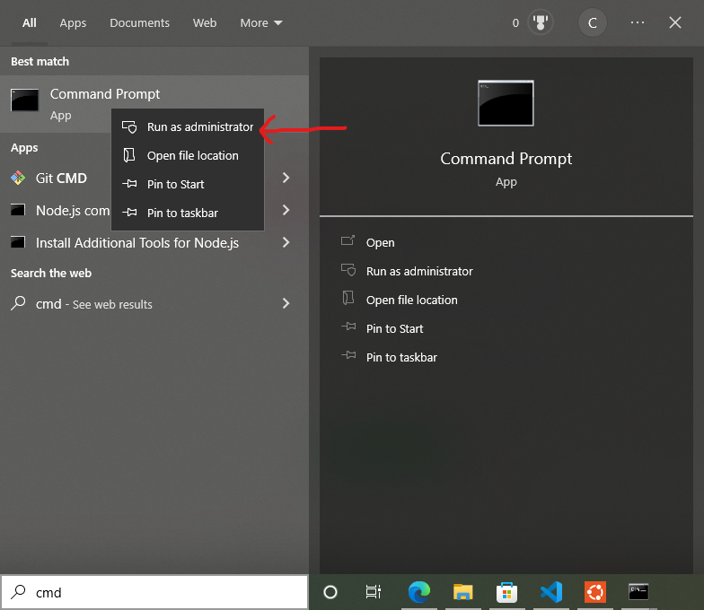

Digite a seguinte linha de comando no terminal (ou abra o arquivo "Instalar dependencias" na pasta do programa, lembre de executar como administrador caso não dê certo)

`pip install matplotlib opencv-python pandas keyboard pyautogui`

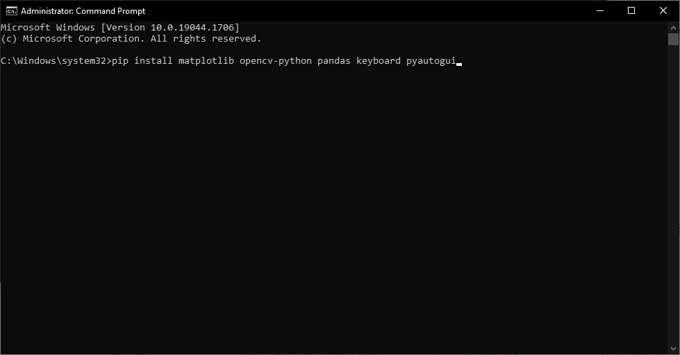

## Usando o programa
**Antes de tudo, o PropTerm deve estar aberto e os campos das informações sobre a substância devem estar devidamente preenchidos.**

Abra o arquivo `Preencher PropTerm`. Existem 2 opções: calcular uma isoterma; calcular um envelope. Estas duas opções são detalhadas em seguida

### Isotermas

Com o programa aberto e com o PropTerm devidamente preenchido, deve-se obter algo semelhante ao que está sendo mostrado abaixo
 
   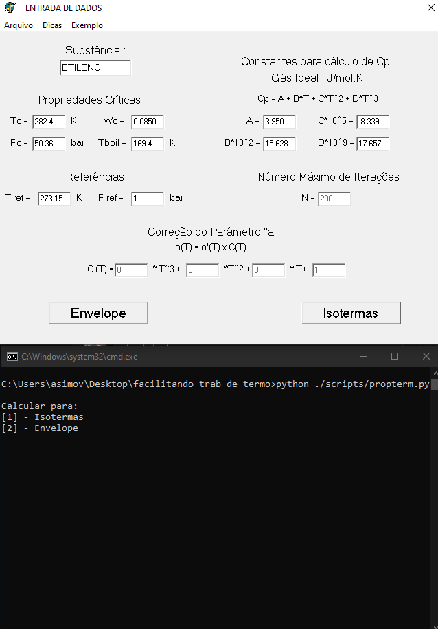

Agora entre na parte de Isotermas do PropTerm e selecione a opção [1] do nosso programa. O resultado deve ser algo parecido com o que tá abaixo

   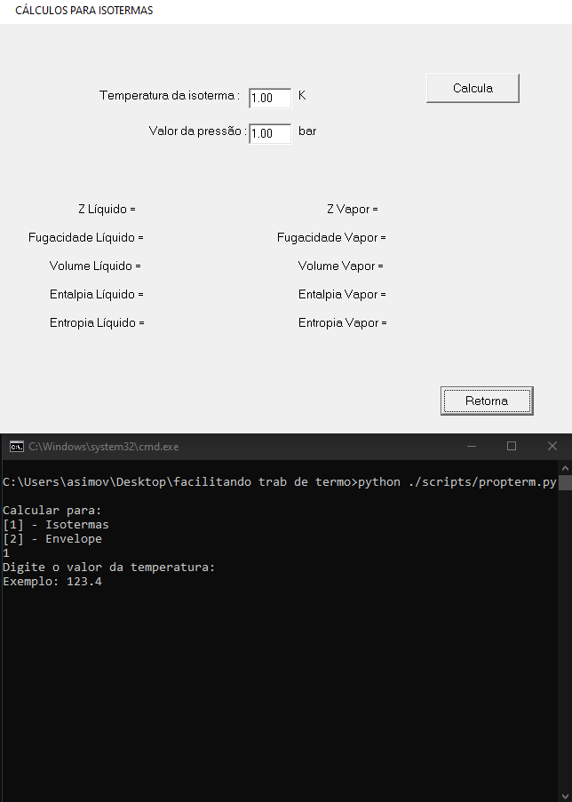
  
Digite os valores desejados para a **temperatura da isoterma**, seguido pelo **valor inicial da pressão (que vai variar até chegar em 1 bar)** e a **quantidade que a pressão vai diminuir** a cada cálculo. 

**`LEMBRE-SE DE DEIXAR O PROPTERM TOTALMENTE VISÍVEL, PARA QUE O PROGRAMA CONSIGA ENXERGAR OS BOTÕES PARA CLICAR NELES!!!`**

   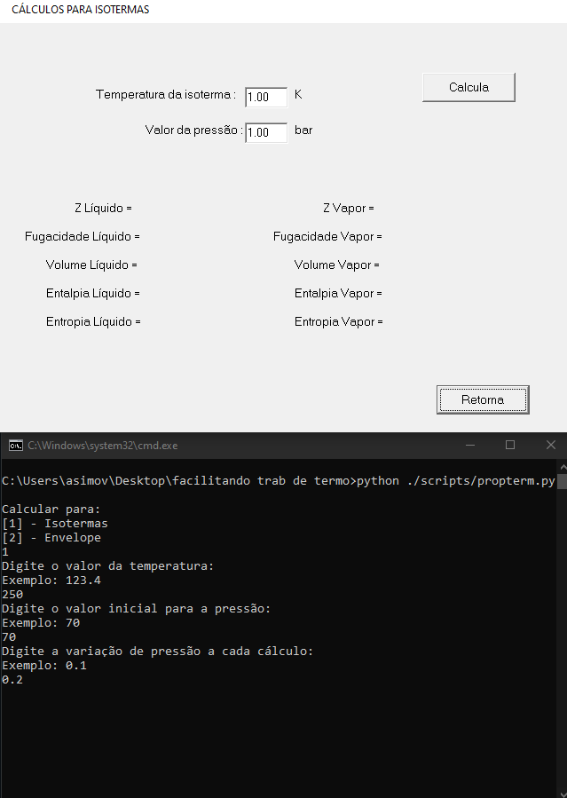

Após isso, o programa vai pedir pra você salvar o arquivo **dentro da pasta ISOTERMAS**, seguindo o nome **isotermaXXX** onde `XXX` representa a temperatura que você tá calculando.

**`ISSO VAI SER IMPORTANTE NA HORA DE GERAR OS GRÁFICOS!!!`**

Depois de salvar o arquivo, clique no terminal e aperte `enter`, o programa cuidará do resto. 

**`SEU COMPUTADOR FICARÁ OCUPADO PREENCHENDO AS INFORMAÇÕES, NÃO DÁ PRA USAR ELE PRA OUTRAS COISAS, ENTÃO SEPARE ALGUNS MINUTOS NA HORA QUE FOR FAZER OS CÁLCULOS.`**

**`SE DER ALGUMA MERDA (IMPROVÁVEL), SEGURE A TECLA ALT QUE O PROGRAMA SERÁ ENCERRADO E SEU MOUSE VAI SER LIBERADO PRA USO.`**

   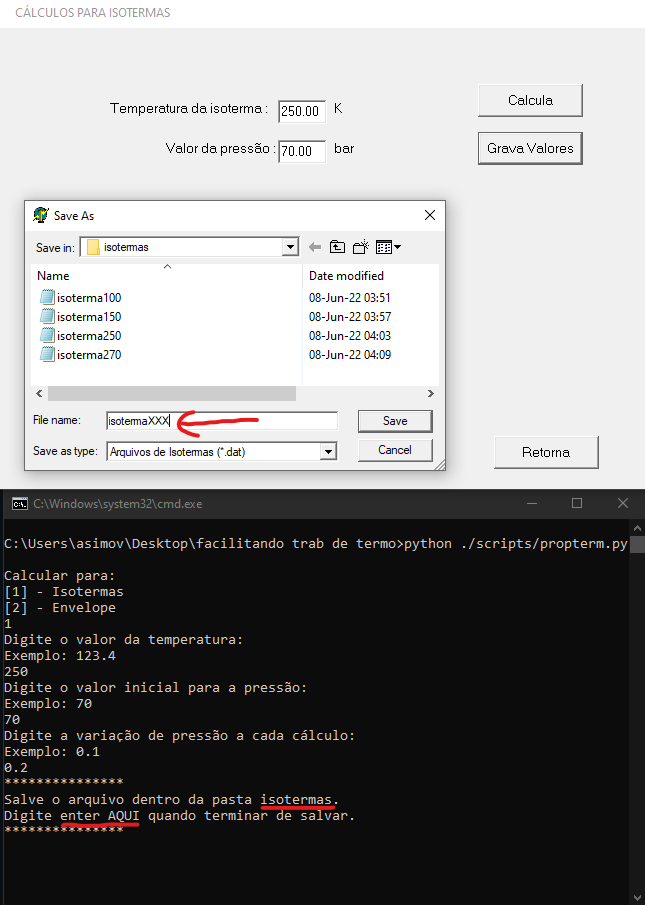

Após o término do programa, se tudo correr bem, a isoterma será calculada, salva e será perguntado se o usuário deseja continuar usando o programa, como mostrado abaixo

   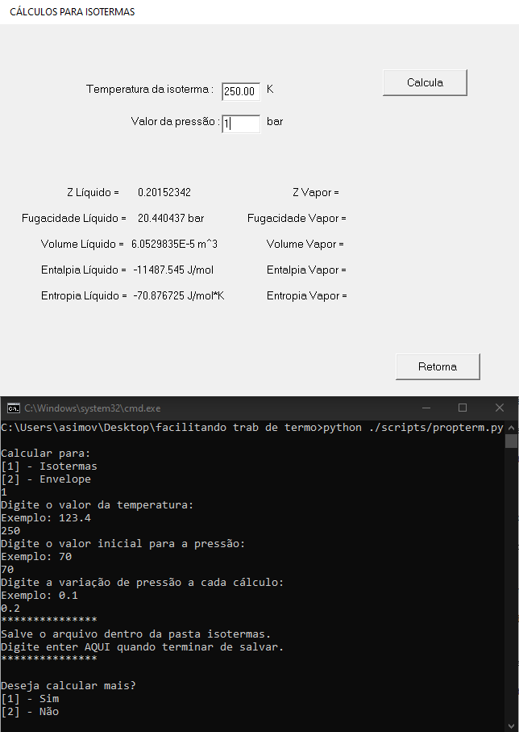
   
### Envelope

Semelhante ao caso das isotermas, mas entrando na parte de Envelope e selecionando a opção [2] do nosso programa, devemos obter uma tela parecida com o que tá abaixo

   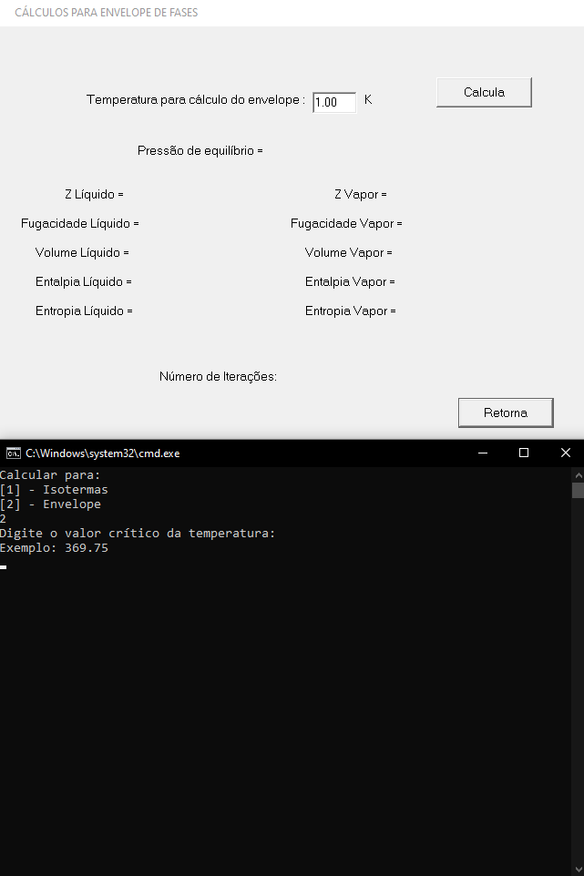

Digite os valores para a **temperatura crítica** da substância, seguido pelo **valor inicial da temperatura (que vai variar até a temperatura crítica)** e **quanto que a temperatura vai DIMINUIR (se você quer que ela aumente, então o valor deve ser negativo, como no exemplo!!)**

   
  
**`LEMBRE-SE DE DEIXAR O PROPTERM TOTALMENTE VISÍVEL, PARA QUE O PROGRAMA CONSIGA ENXERGAR OS BOTÕES PARA CLICAR NELES!!!`**

Após isso, o programa vai pedir pra você salvar o arquivo **dentro da pasta ENVELOPE**, seguindo exatamente o nome **envelope**, importante dizer que só pode ter um arquivo com o nome envelope nessa pasta.

**`ISSO VAI SER IMPORTANTE NA HORA DE GERAR OS GRÁFICOS!!!`**

Depois de salvar o arquivo, clique no terminal e aperte `enter`, o programa cuidará do resto. 

**`SEU COMPUTADOR FICARÁ OCUPADO PREENCHENDO AS INFORMAÇÕES, NÃO DÁ PRA USAR ELE PRA OUTRAS COISAS, ENTÃO SEPARE ALGUNS MINUTOS NA HORA QUE FOR FAZER OS CÁLCULOS.`**

**`SE DER ALGUMA MERDA (IMPROVÁVEL), SEGURE A TECLA ALT QUE O PROGRAMA SERÁ ENCERRADO E SEU MOUSE VAI SER LIBERADO PRA USO.`**

   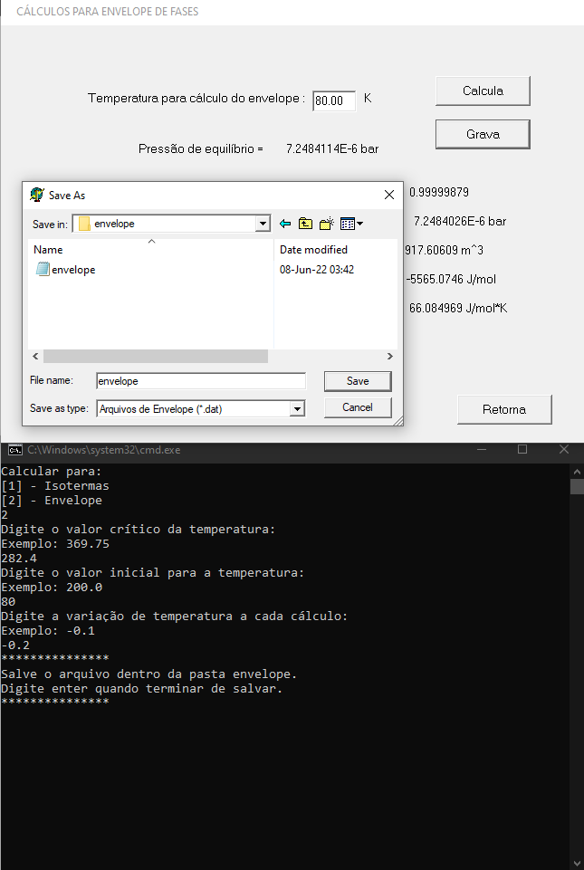

Após o término do programa, se tudo correr bem, o envelope será calculado, salvo e será perguntado se o usuário deseja continuar usando o programa.
